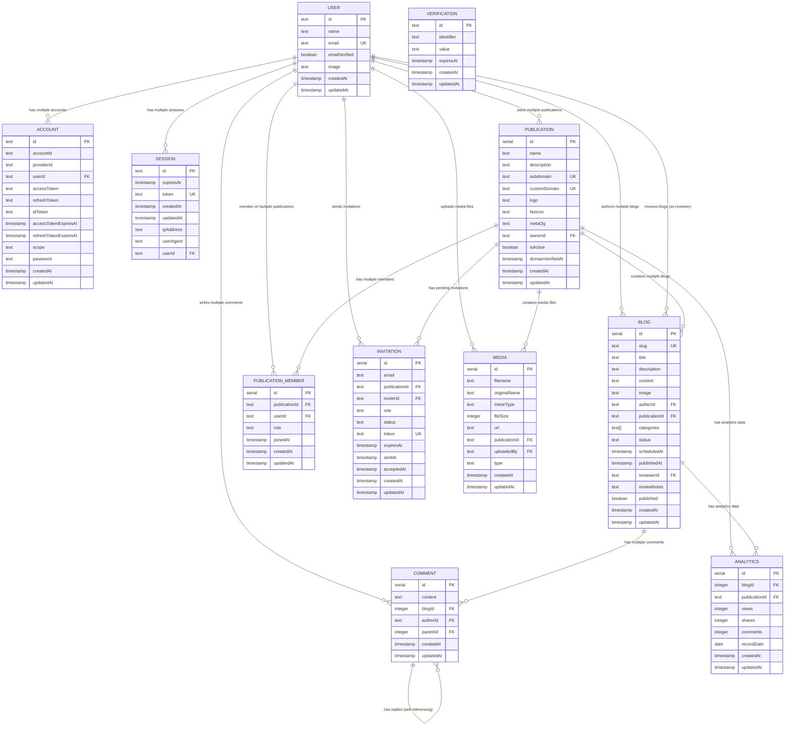

# InkSigma Database Architecture Diagram

## Database Overview
**Database Type:** PostgreSQL  
**ORM:** Drizzle ORM  
**Authentication:** Better Auth  
**Project Type:** Blog/Content Management Platform  

## Entity Relationship Diagram



## Table Descriptions

### Core Authentication Tables

#### **USER**
- **Purpose:** Central user entity for the platform
- **Key Features:** 
  - Email-based authentication with verification
  - Profile information (name, image)
  - Unique email constraint
- **Relationships:** One-to-many with accounts, sessions, blogs, and comments

#### **ACCOUNT**
- **Purpose:** OAuth and social login provider accounts
- **Key Features:**
  - Supports multiple authentication providers (Google, etc.)
  - Stores OAuth tokens and credentials
  - Links external accounts to internal users
- **Relationships:** Many-to-one with users

#### **SESSION**
- **Purpose:** User session management
- **Key Features:**
  - Token-based session tracking
  - IP address and user agent logging
  - Session expiration management
- **Relationships:** Many-to-one with users

#### **VERIFICATION**
- **Purpose:** Email verification and password reset tokens
- **Key Features:**
  - Temporary verification codes
  - Expiration handling
  - Used for email verification and password resets

### Publication Management Tables

#### **PUBLICATION**
- **Purpose:** Multi-tenant publication system with domain management
- **Key Features:**
  - **Subdomain System:** Free `subdomain.inksigma.com` for each publication
  - **Custom Domain Integration:** Full custom domain support with DNS verification
  - **Branding Assets:** Logo, favicon, and meta OG image management
  - **Publication Metadata:** Name, description, and SEO settings
  - **Domain Verification:** Tracks custom domain verification status
  - **Multi-Publication Support:** Users can own multiple publications
- **Domain Features:**
  - Automatic subdomain generation (`username.inksigma.com`)
  - Custom domain mapping with DNS A-record verification
  - Domain change restrictions (14-day cooldown period)
  - SSL certificate management for custom domains
- **Relationships:**
  - Many-to-one with users (owner)
  - One-to-many with publication members
  - One-to-many with blogs

#### **PUBLICATION_MEMBER**
- **Purpose:** Multi-user publication collaboration system
- **Key Features:**
  - **Role-Based Access:** Owner, Editor, Author, Reviewer roles
  - **Member Management:** Invite and manage publication contributors
  - **Permission Control:** Role-based content access and workflow permissions
  - **Join Tracking:** Member activity and participation history
- **Role Types:** 'owner', 'editor', 'author', 'reviewer', 'viewer'
- **Relationships:**
  - Many-to-one with publications
  - Many-to-one with users

### Content Management Tables

#### **BLOG**
- **Purpose:** Main content entity for blog posts with comprehensive workflow management
- **Key Features:**
  - SEO-friendly slugs (unique)
  - Rich content storage with TipTap editor
  - Category tagging (PostgreSQL array field)
  - **Workflow Status Management:** draft → review → scheduled → published → unpublished → trash
  - Scheduling system with future publication dates
  - Review system with reviewer assignment and notes
  - Featured images and thumbnails
  - Publication timestamp tracking
- **Status Values:** 'draft', 'review', 'scheduled', 'published', 'unpublished', 'trash'
- **Relationships:** 
  - Many-to-one with users (author)
  - Many-to-one with users (reviewer - optional)
  - Many-to-one with publications (publication context)
  - One-to-many with comments

#### **COMMENT**
- **Purpose:** User comments and discussions on blog posts
- **Key Features:**
  - Hierarchical structure (parent-child relationships)
  - Threaded conversations support
  - Author attribution
  - Bulk management (select all, delete multiple)
- **Relationships:**
  - Many-to-one with blogs
  - Many-to-one with users (author)
  - Self-referencing for reply threads

### Collaboration & Invitation Tables

#### **INVITATION**
- **Purpose:** Member invitation system for publication collaboration
- **Key Features:**
  - **Email-Based Invitations:** Send invites to email addresses
  - **Role Assignment:** Specify role during invitation (Editor, Author, Reviewer)
  - **Status Tracking:** Pending, Accepted, Expired, Cancelled states
  - **Token Security:** Unique invitation tokens for secure acceptance
  - **Expiration Management:** Time-limited invitations with auto-expiry
  - **Resend Capability:** Re-invite expired or failed invitations
- **Status Values:** 'pending', 'accepted', 'expired', 'cancelled'
- **Relationships:**
  - Many-to-one with publications
  - Many-to-one with users (inviter)

### Analytics & Tracking Tables

#### **ANALYTICS**
- **Purpose:** Comprehensive analytics and statistics tracking
- **Key Features:**
  - **Blog-Level Analytics:** Individual post performance metrics
  - **Publication-Level Analytics:** Overall publication statistics
  - **Time-Series Data:** Daily, weekly, monthly, yearly aggregations
  - **Engagement Metrics:** Views, shares, comments tracking
  - **Custom Date Ranges:** Flexible reporting periods
- **Metrics Tracked:**
  - Page views and unique visitors
  - Social media shares
  - Comment engagement
  - Publication-wide statistics
- **Relationships:**
  - Many-to-one with blogs (optional - for blog-specific analytics)
  - Many-to-one with publications (for publication-wide analytics)

### Media Management Tables

#### **MEDIA**
- **Purpose:** Centralized file and media management system
- **Key Features:**
  - **Multi-Format Support:** Images, documents, videos, audio files
  - **Publication Branding:** Logo (400x400px), Favicon (32x32px), Meta OG (630x1200px)
  - **Blog Assets:** Featured images, thumbnails, inline media
  - **File Metadata:** Original names, MIME types, file sizes
  - **User Attribution:** Track who uploaded each file
  - **Type Classification:** Categorize by usage (logo, favicon, blog-image, etc.)
- **File Types:** 'logo', 'favicon', 'meta-og', 'blog-image', 'thumbnail', 'document'
- **Relationships:**
  - Many-to-one with publications
  - Many-to-one with users (uploader)

## Database Features & Patterns

### Authentication Flow
1. **Registration:** User → Verification → Email Confirmation
2. **Login:** Multiple methods (email/password, magic link, OAuth)
3. **Session Management:** Token-based with expiration
4. **Social Auth:** Google OAuth integration via Account table

### Publication & Domain Management Flow

#### **Publication Creation**
1. **Setup:** User creates publication with name and subdomain
2. **Subdomain:** Auto-assigned `subdomain.inksigma.com` domain
3. **Branding:** Upload logo, favicon, and meta OG images
4. **Settings:** Configure publication description and metadata

#### **Custom Domain Integration**
1. **Domain Entry:** User enters owned custom domain
2. **DNS Configuration:** User updates A-record to point to InkSigma servers
3. **Verification:** System verifies DNS propagation and domain ownership
4. **SSL Setup:** Automatic SSL certificate provisioning
5. **Domain Mapping:** Custom domain maps to publication content
6. **Cooldown:** 14-day restriction on domain changes

#### **Member Management**
1. **Invitation:** Publication owner invites members by email
2. **Role Assignment:** Assign roles (Editor, Author, Reviewer)
3. **Access Control:** Role-based permissions for content workflow
4. **Collaboration:** Multiple users can contribute to single publication

### Content Management Flow
1. **Blog Creation:** User creates blog within publication context → **Draft** state
2. **Review Process:** Draft → **Review** (assigned to publication reviewer)
3. **Review Decision:** 
   - **Accept:** Review → **Scheduled** or **Published**
   - **Reject:** Review → **Draft** (with review notes)
4. **Scheduling:** Scheduled blogs auto-publish at `scheduledAt` timestamp
5. **Publication Management:** 
   - **Published:** Live on publication domain (subdomain or custom)
   - **Unpublished:** Temporarily hidden but not deleted
   - **Trash:** Soft deleted, can be restored
6. **Commenting:** Users can comment and reply to published blogs
7. **Categorization:** Blogs support multiple categories via PostgreSQL arrays

### Data Integrity
- **Foreign Key Constraints:** Ensure referential integrity
- **Unique Constraints:** Prevent duplicate emails and slugs
- **Timestamps:** Automatic creation and update tracking
- **Soft Relationships:** Comments support hierarchical threading

### Scalability Considerations
- **Indexed Fields:** Primary keys, foreign keys, unique constraints
- **Array Fields:** Categories stored as PostgreSQL arrays
- **Text Fields:** Flexible content storage for rich text
- **Serial IDs:** Auto-incrementing for blogs and comments

## Technology Stack Integration

### Drizzle ORM Features Used
- **Type Safety:** Full TypeScript integration
- **Schema Definition:** Declarative table definitions
- **Migrations:** Automated schema versioning
- **Query Builder:** Type-safe database queries

### Better Auth Integration
- **Adapter Pattern:** Drizzle adapter for Better Auth
- **Multi-Provider:** Email, magic link, and OAuth support
- **Security:** Built-in session management and verification

### PostgreSQL Features
- **JSONB Support:** Ready for future JSON field additions
- **Array Types:** Native array support for categories
- **Full-Text Search:** Potential for content search features
- **Transactions:** ACID compliance for data integrity

## Blog Workflow States & Pages

### Current Implementation Status
The application includes comprehensive workflow management with dedicated pages for each state:

#### **Draft** (`/draft`)
- **Purpose:** Work-in-progress articles
- **Features:** Bulk publish, bulk delete, edit capabilities
- **Actions:** Publish → Review/Published, Delete → Trash

#### **Review** (`/review`)
- **Purpose:** Articles pending editorial review
- **Features:** Accept/Reject workflow, reviewer assignment
- **Actions:** Accept → Scheduled/Published, Reject → Draft

#### **Author Review** (`/author-review`)
- **Purpose:** Author's view of articles under review
- **Features:** Revert to draft capability
- **Actions:** Revert → Draft

#### **Scheduled** (`/schedule`)
- **Purpose:** Articles scheduled for future publication
- **Features:** Scheduled publication management, bulk operations
- **Actions:** Auto-publish at scheduled time, Edit schedule

#### **Published** (`/published`)
- **Purpose:** Live, publicly visible articles
- **Features:** View statistics, manage published content
- **Actions:** Unpublish → Unpublished, Delete → Trash

#### **Unpublished** (`/unpublished`)
- **Purpose:** Previously published but temporarily hidden articles
- **Features:** Restore to published state
- **Actions:** Republish → Published, Delete → Trash

#### **Trash** (`/trash`)
- **Purpose:** Soft-deleted articles (recoverable)
- **Features:** Restore or permanently delete
- **Actions:** Restore → Previous state, Permanent delete

### Recommended Database Schema Enhancements

To fully support the current workflow, consider adding these fields to the `blog` table:

```sql
-- Publication management tables
CREATE TABLE publication (
    id SERIAL PRIMARY KEY,
    name TEXT NOT NULL,
    description TEXT,
    subdomain TEXT UNIQUE NOT NULL,
    custom_domain TEXT UNIQUE,
    logo TEXT,
    favicon TEXT,
    meta_og TEXT,
    owner_id TEXT NOT NULL REFERENCES user(id),
    is_active BOOLEAN DEFAULT true,
    domain_verified_at TIMESTAMP,
    created_at TIMESTAMP DEFAULT NOW(),
    updated_at TIMESTAMP DEFAULT NOW()
);

CREATE TABLE publication_member (
    id SERIAL PRIMARY KEY,
    publication_id INTEGER NOT NULL REFERENCES publication(id),
    user_id TEXT NOT NULL REFERENCES user(id),
    role VARCHAR(20) NOT NULL DEFAULT 'author',
    joined_at TIMESTAMP DEFAULT NOW(),
    created_at TIMESTAMP DEFAULT NOW(),
    updated_at TIMESTAMP DEFAULT NOW(),
    UNIQUE(publication_id, user_id)
);

-- Invitation system for collaboration
CREATE TABLE invitation (
    id SERIAL PRIMARY KEY,
    email TEXT NOT NULL,
    publication_id INTEGER NOT NULL REFERENCES publication(id),
    inviter_id TEXT NOT NULL REFERENCES user(id),
    role VARCHAR(20) NOT NULL DEFAULT 'author',
    status VARCHAR(20) DEFAULT 'pending',
    token TEXT UNIQUE NOT NULL,
    expires_at TIMESTAMP NOT NULL,
    sent_at TIMESTAMP DEFAULT NOW(),
    accepted_at TIMESTAMP,
    created_at TIMESTAMP DEFAULT NOW(),
    updated_at TIMESTAMP DEFAULT NOW()
);

-- Analytics and statistics tracking
CREATE TABLE analytics (
    id SERIAL PRIMARY KEY,
    blog_id INTEGER REFERENCES blog(id),
    publication_id INTEGER REFERENCES publication(id),
    views INTEGER DEFAULT 0,
    shares INTEGER DEFAULT 0,
    comments INTEGER DEFAULT 0,
    record_date DATE NOT NULL,
    created_at TIMESTAMP DEFAULT NOW(),
    updated_at TIMESTAMP DEFAULT NOW(),
    UNIQUE(blog_id, record_date),
    UNIQUE(publication_id, record_date)
);

-- Media and file management
CREATE TABLE media (
    id SERIAL PRIMARY KEY,
    filename TEXT NOT NULL,
    original_name TEXT NOT NULL,
    mime_type TEXT NOT NULL,
    file_size INTEGER NOT NULL,
    url TEXT NOT NULL,
    publication_id INTEGER REFERENCES publication(id),
    uploaded_by TEXT NOT NULL REFERENCES user(id),
    type VARCHAR(20) NOT NULL, -- 'logo', 'favicon', 'meta-og', 'blog-image', 'thumbnail', 'document'
    created_at TIMESTAMP DEFAULT NOW(),
    updated_at TIMESTAMP DEFAULT NOW()
);

-- Enhanced blog table for complete workflow support
ALTER TABLE blog ADD COLUMN status VARCHAR(20) DEFAULT 'draft';
ALTER TABLE blog ADD COLUMN publication_id INTEGER REFERENCES publication(id);
ALTER TABLE blog ADD COLUMN scheduled_at TIMESTAMP;
ALTER TABLE blog ADD COLUMN published_at TIMESTAMP;
ALTER TABLE blog ADD COLUMN reviewer_id TEXT REFERENCES user(id);
ALTER TABLE blog ADD COLUMN review_notes TEXT;
ALTER TABLE blog ADD COLUMN deleted_at TIMESTAMP; -- For soft delete
ALTER TABLE blog ADD COLUMN previous_status VARCHAR(20); -- For restore functionality

-- Create indexes for efficient queries
CREATE INDEX idx_blog_status ON blog(status);
CREATE INDEX idx_blog_publication_id ON blog(publication_id);
CREATE INDEX idx_blog_scheduled_at ON blog(scheduled_at);
CREATE INDEX idx_blog_deleted_at ON blog(deleted_at);
CREATE INDEX idx_publication_subdomain ON publication(subdomain);
CREATE INDEX idx_publication_custom_domain ON publication(custom_domain);
CREATE INDEX idx_publication_owner ON publication(owner_id);
CREATE INDEX idx_invitation_email ON invitation(email);
CREATE INDEX idx_invitation_token ON invitation(token);
CREATE INDEX idx_invitation_status ON invitation(status);
CREATE INDEX idx_analytics_date ON analytics(record_date);
CREATE INDEX idx_analytics_blog ON analytics(blog_id);
CREATE INDEX idx_analytics_publication ON analytics(publication_id);
CREATE INDEX idx_media_publication ON media(publication_id);
CREATE INDEX idx_media_type ON media(type);
```

## Domain & Publication Architecture

### Domain Management System
The platform supports a **dual-domain approach**:

#### **Free Subdomains**
- **Format:** `username.inksigma.com`
- **Auto-Generation:** Created during publication setup
- **Instant Activation:** No verification required
- **SSL Included:** Automatic HTTPS certificates

#### **Custom Domain Integration**
- **User-Owned Domains:** Connect existing domains (e.g., `myblog.com`)
- **DNS Verification:** A-record pointing to InkSigma servers
- **SSL Provisioning:** Automatic certificate generation
- **Domain Restrictions:** 14-day cooldown between changes
- **Verification Tracking:** `domain_verified_at` timestamp

### Multi-Publication Support
Users can create and manage multiple publications:
- **Personal Publications:** Individual blogs and content sites
- **Team Publications:** Collaborative content with multiple contributors
- **Role-Based Access:** Owner, Editor, Author, Reviewer permissions
- **Cross-Publication Analytics:** Unified dashboard for all publications

### Publication Branding
Each publication supports complete branding customization:
- **Logo Management:** 400x400px optimal resolution
- **Favicon Support:** 32x32px for browser tabs
- **Meta OG Images:** 630x1200px for social media sharing
- **Custom Styling:** Theme and layout customization (future)

## Complete Feature Coverage

### ✅ Implemented Features in Database Design

#### **Authentication & User Management**
- ✅ Multi-provider authentication (email, magic link, Google OAuth)
- ✅ Email verification and password reset
- ✅ Session management with device tracking

#### **Publication & Domain Management**
- ✅ Multi-publication support per user
- ✅ Free subdomain system (`username.inksigma.com`)
- ✅ Custom domain integration with DNS verification
- ✅ Publication branding (logo, favicon, meta OG)
- ✅ Domain change restrictions (14-day cooldown)

#### **Content Workflow System**
- ✅ 7-state blog workflow (draft → review → scheduled → published → unpublished → trash)
- ✅ Review system with reviewer assignment
- ✅ Scheduling system for future publication
- ✅ Bulk operations (select all, bulk publish, bulk delete)
- ✅ Soft delete with restore capability

#### **Collaboration Features**
- ✅ Role-based member system (Owner, Editor, Author, Reviewer)
- ✅ Email invitation system with token security
- ✅ Invitation status tracking (pending, expired, accepted)
- ✅ Resend and re-invite capabilities

#### **Analytics & Statistics**
- ✅ Blog-level analytics (views, shares, comments)
- ✅ Publication-level statistics
- ✅ Time-series data with custom date ranges
- ✅ Daily, weekly, monthly, yearly aggregations

#### **Media Management**
- ✅ Centralized file upload system
- ✅ Publication branding assets management
- ✅ Blog images and thumbnails
- ✅ File metadata and type classification

#### **Comment System**
- ✅ Hierarchical threaded comments
- ✅ Comment management and moderation
- ✅ Bulk comment operations

### 🚀 Future Expansion Possibilities

Based on the current comprehensive schema, potential additions could include:

1. **Advanced Monetization:** Subscription tiers, paywall content, tip jars, revenue analytics
2. **SEO Enhancement:** Advanced meta tags, sitemap generation, schema markup, SEO scoring
3. **Email Marketing:** Newsletter management, subscriber lists, automated email campaigns
4. **Social Media Integration:** Auto-posting, social login providers, content syndication
5. **Advanced Themes:** Custom CSS editor, theme marketplace, white-label solutions
6. **API & Integrations:** RESTful API, webhooks, third-party integrations
7. **Performance Features:** CDN integration, image optimization, advanced caching
8. **Advanced Analytics:** Heat maps, user behavior tracking, conversion funnels
9. **Collaboration Tools:** Real-time editing, live comments, approval workflows
10. **Enterprise Features:** SSO integration, advanced permissions, audit logs

### 📊 Database Performance Considerations

The current schema is optimized for:
- **High Read Performance:** Proper indexing on frequently queried fields
- **Scalable Analytics:** Separate analytics table for time-series data
- **Efficient Workflows:** Status-based indexing for quick filtering
- **Multi-Tenancy:** Publication-based data isolation
- **Media Optimization:** Separate media table for file management

---

*This diagram represents the current database structure of the InkSigma blogging platform as of the latest schema migration.*